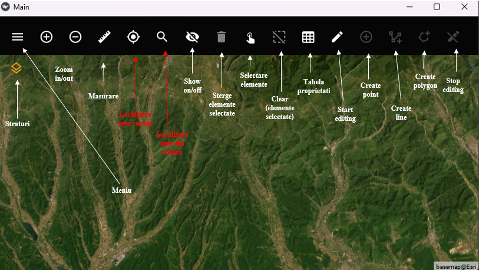

# MillApp

## Screenshots

### 1. Screenshot

### 2. Selectare basemap
.png>)

### 3. Selectare OSM
.png>)

### 4. Meniu
.png>)

### 5. Conectare la server
.png>)

### 6. Mesaj confirmare conectare
.png>)

### 7. Meniu actualizat
.png>)

### 8. Distanța
.png>)

### 9. Arie și perimetru
.png>)

### 10. Creare punct
.png>)

### 11. Selectare element
.png>)

### 12. Modificare atribute
.png>)

### 13. Elemente șterse
.png>)

### 14. Mod editare
.png>)
